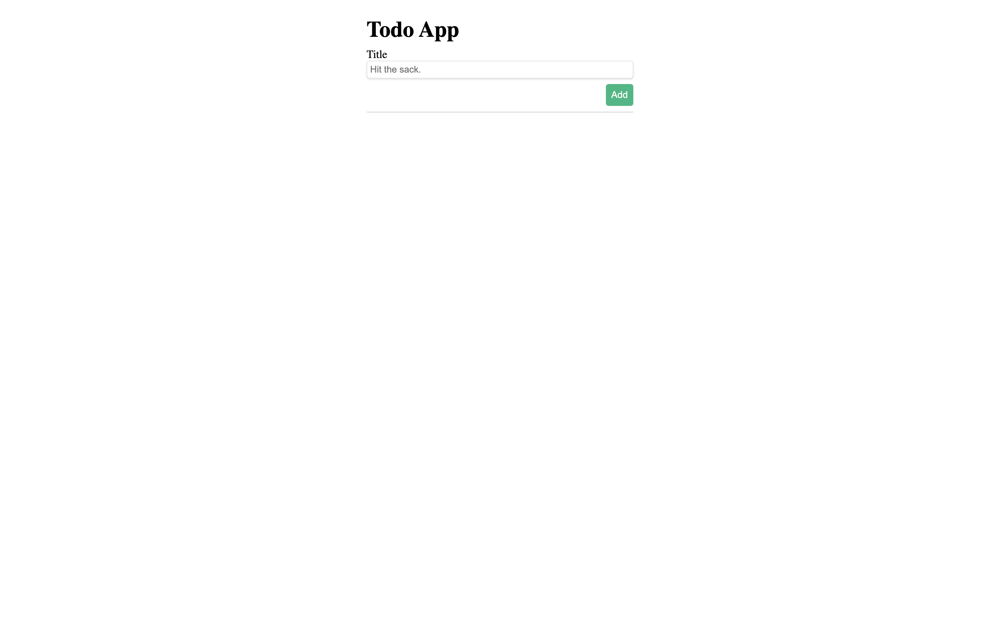
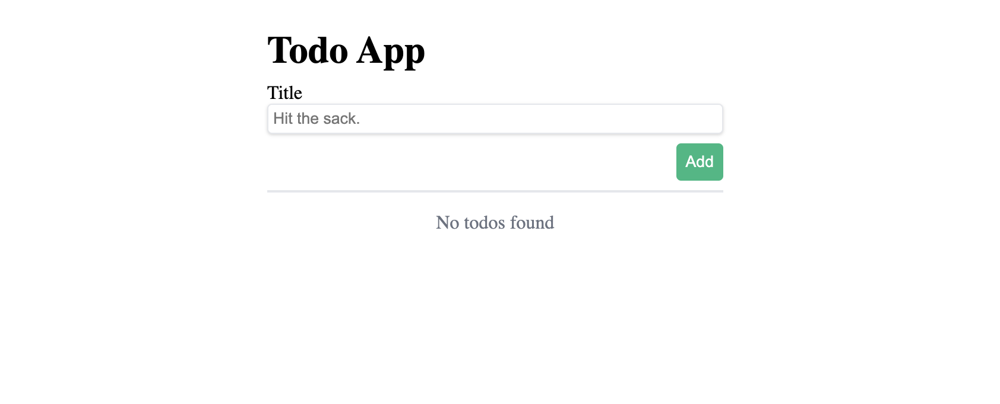
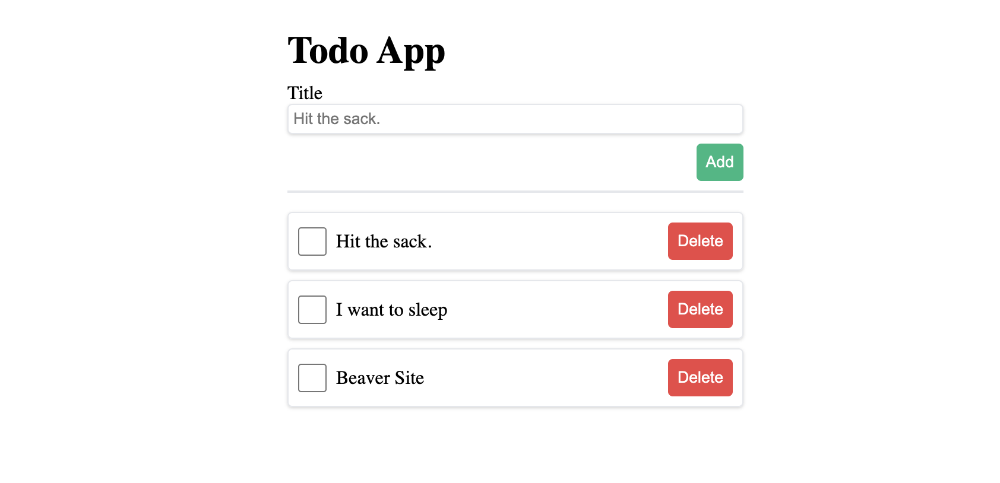

# Day 1 - Exercise 1

## Exercise 1.1
ให้น้องๆเขียน CSS ให้ไฟล์ **App.jsx** ให้ได้หน้าตาดังนี้

## Exercise 1.2
ให้น้องๆสร้าง state ให้กับ input title ของเรา และ เมื่อกดปุ่มให้ทำการ `console.log()` ค่าที่เรารับมาจาก input title

## Exercise 1.3
1. ให้น้องๆสร้าง state ชื่อ **todo** โดยให้ค่าเริ่มต้นเป็น Array เปล่า
2. ให้น้องๆสร้าง function มาจัดการ event ในปุ่ม **Add** โดยถ้าปุ่มถูกกดให้เพิ่ม object เข้าไปใน **todo** และ object จะมี key ประกอบด้วย **title, completed** โดย completed จะมีค่าเป็น false
3. ให้น้องๆแก้ไขไฟล์ **App.jsx** ให้ เมื่อ **todo** มีสมาชิกเท่ากับ 0 ให้แสดงผลว่า `No todos found`
   
4. ให้น้องๆแก้ไขไฟล์ **App.jsx** ให้นำ todo มา Loop แสดงผลออกมาคล้ายๆตัวอย่างข้างล่าง
   

