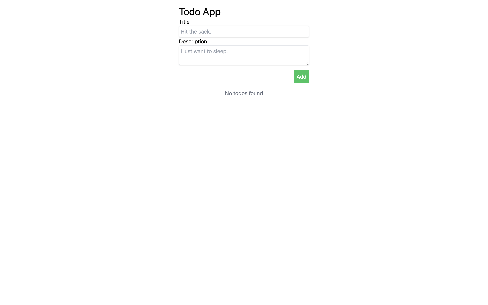
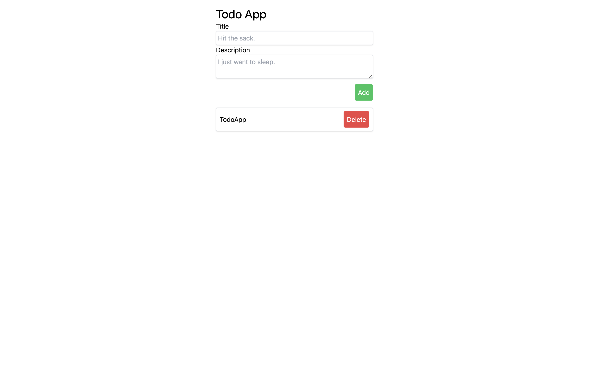

# Day 2 Exercise 1

## Exercise 1.1
ให้น้องๆ เพื่ม element input description และตกแต่งให้สวยงาม

ตัวอย่าง


## Exercise 1.2
ให้น้องๆ ทำ router โดยมีดังนี้ `/`, `/:id` และให้แสดงผลตามนี้ 
```markdown
 `/` -> App.jsx

 `/:id` -> TodoInfo.jsx
```

## Exercise 1.3
ให้น้องๆ แก้ไขไฟล์ **App.jsx** โดยให้นำ Checkbox ออกแล้วให้กดเพื่อไปอีกหน้าหนึ่งแทนโดยให้ params เป็น ลำดับในสมาชิกของ **todos**

