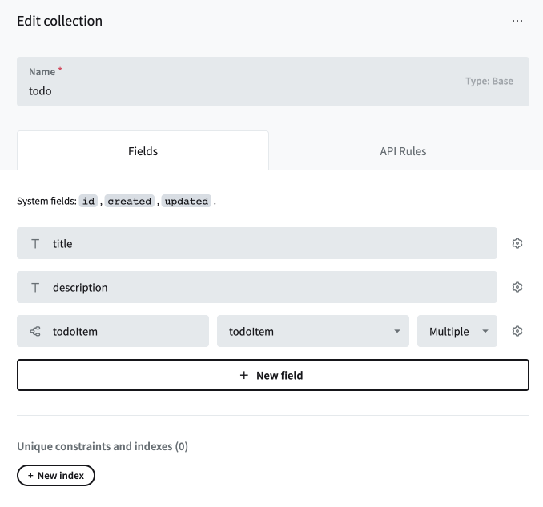

# Day 2 Exercise 3

## Exercise 3.1
ให้น้อง ๆ สร้าง Collection ใน PocketBase ชื่อ `todoItem` โดยมี field ดังนี้

1. title เป็น Plain text
2. completed เป็น Boolean
   
## Exercise 3.2
ให้น้อง ๆ แก้ไข Collection ใน PocketBase ที่ชื่อ `todo` ดังนี้

1. สร้าง Field ใหม่เป็นประเภท Relation ตั้งชื่อของ Field ว่า todoItem
2. todoItem จะมี Relationship กับ todoItem และ เป็นแบบ multiple

น้อง ๆ จะได้ผลลัพธ์ตามรูปตัวอย่าง ด้านล่าง

## Exercise 3.3
ให้น้อง ๆ แก้ไขไฟล์ **TodoInfo.jsx** เป็นเมื่อกดปุ่ม Add ให้เพิ่มข้อมูล เข้าไปใน Collection todoItem ใน Pocket base

## Exercise 3.4
ให้น้อง ๆ แก้ไขไฟล์ **TodoInfo.jsx** เป็นเมื่อกดปุ่ม Delete ให้ลบข้อมูล ออกจาก Collection todoItem ใน Pocket base
