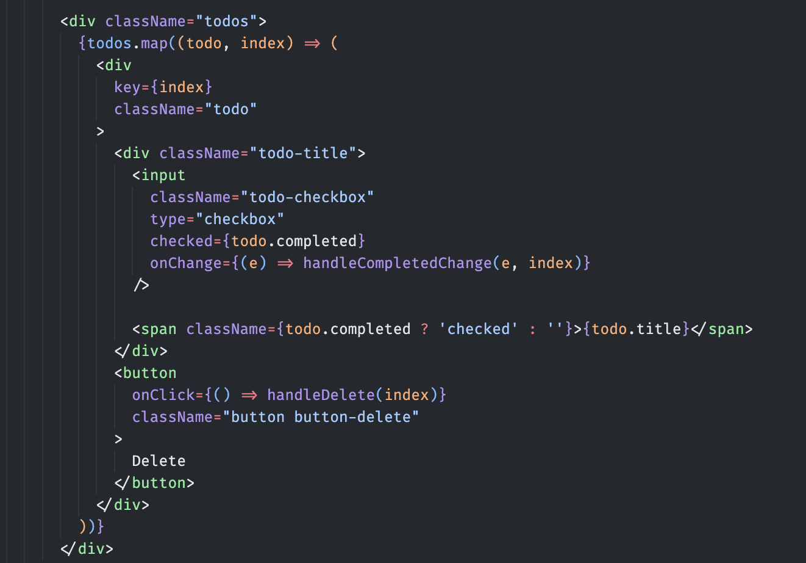
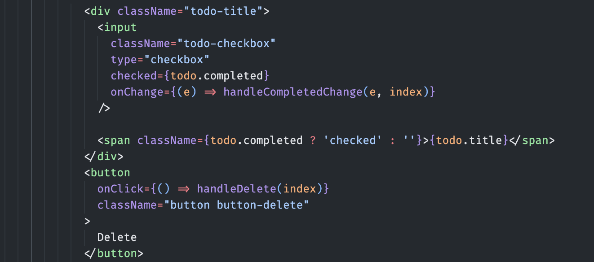

# Day 1 - Exercise 2

## Exercise 2.1
ให้น้องๆ แก้ไขไฟล์ **App.jsx** โดยสร้าง Component ขึ้นมาสองตัวชื่อว่า **Todo, TodoItem** แล้วนำ Code ดังต่อไปนี้ไปปรับใช้ใน Component
### 1. Todo
  
### 2. TodoItem
  

__**โดยที่ TodoItem จะอยู่ใน Todo**__

```markdown
App.jsx
  ⌙ Todo.jsx
      ⌙ TodoItem.jsx
```

## Exercise 2.2
ให้น้องๆ ใช้ useEffect เพื่อใช้ในการเก็บ todo เข้าไปใน Local storage เมื่อ todo มีการเปลี่ยนแปลง

### Local storage
`localStorage.setItem('myCat', 'Tom');` - ตั้ง key ว่า   myCat และ value เป็น 'Tom'

`localStorage.getItem('myCat');` - ใช้เพื่อดึงค่ามาจาก Local storage โดยใช key

`localStorage.removeItem('myCat');` - ลบข้อมูลออกจาก Local storage โดยใช้ key
